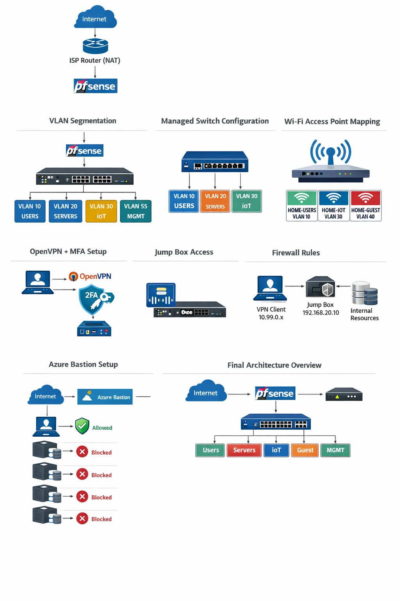

# Zero Trust Home Lab

## Table of Contents
- [Architecture Diagram](#architecture-diagram)
- [Project Overview](./docs/01-project-overview.md)
- [Network Design](./docs/02-network-design.md)
- [VLANs and IP Plan](./docs/03-vlans-and-ip-plan.md)
- [Switch Configuration](./docs/04-switch-configuration.md)
- [Access Point Configuration](./docs/05-access-point-configuration.md)
- [Firewall Rules](./docs/06-firewall-rules.md)
- [VPN and MFA](./docs/07-vpn-and-mfa.md)
- [Jump Box](./docs/08-jump-box.md)
- [Troubleshooting](./docs/09-troubleshooting.md)

---# Zero Trust Homelab
Zero-trust test home lab with pfSense VLAN segmentation, OpenVPN MFA, jump-box-only access, and Azure private VM extension.

This project documents the design and implementation of a zero-trust home lab using pfSense, VLAN segmentation, managed switching, multi-SSID Wi-Fi, OpenVPN with RADIUS-based MFA, and a controlled jump-box access model. The project also includes an Azure private VM extension using Azure Bastion.
## Core Features
- VLAN-based network segmentation
- Centralized routing and firewall policy with pfSense
- Managed switch VLAN tagging and access port design
- Multi-SSID access point mapped to VLANs
- Centralized DHCP and DNS through pfSense
- OpenVPN remote access with FreeRADIUS + TOTP MFA
- Jump-box-only access model for least privilege
- Azure private jump box with no public VM exposure
## Architecture Diagram

## Documentation
- [Project Overview](./docs/01-project-overview.md)
- [Network Design](./docs/02-network-design.md)
- [VLANs and IP Plan](./docs/03-vlans-and-ip-plan.md)
- [Switch Configuration](./docs/04-switch-configuration.md)
- [Access Point Configuration](./docs/05-access-point-configuration.md)
- [Firewall Rules](./docs/06-firewall-rules.md)
- [VPN and MFA](./docs/07-vpn-and-mfa.md)
- [Jump Box](./docs/08-jump-box.md)
- [Troubleshooting](./docs/09-troubleshooting.md)